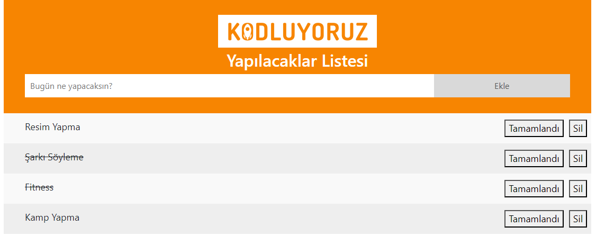

# To Do List

Bu repo [Kodluyoruz](https://www.kodluyoruz.org/) Front-End Eğitiminde oluşturduğumuz ToDo list projesi. İçerisinde bir adet README dosyası, index.html, script.js, .gitignore dosyası barındırıyor.



### Installation
---
Öncelikle projeyi clonelayın.

```
git clone https://github.com/Dogukan-Hellac/patika-ToDo.git
```
### Usage
---
Projeyi cloneladıktan sonra Visual Studio Code programında açınız.

Linux için:
```
cd kodluyoruzilkrepo
code .
```
### Contributing
---
Pull requestler kabul edilir. Büyük değişiklikler için, lütfen önce neyi değiştirmek istediğinizi tartışmak için bir konu açınız.
### License
---
[MIT](https://choosealicense.com/licenses/mit/)